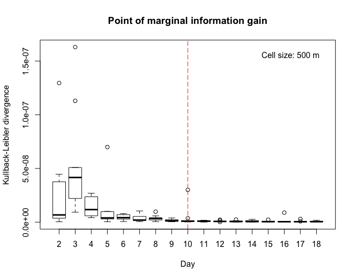

# Minimum location data
Calculate the minimum number of days needed to collect human location data for activity space research using a study sample.

## Input 
`minimum-location-data.R` reads a  CSV file of time-weighted location data from multiple participants over a common series of dates. The specification is:

| Field | Type | Description |
| ----- | ----- | ----- |
| id | Integer | Integer that identifies a participant. |
| date | YYYY-MM-DD | Date that the location was recorded. |
| duration_s | Integer | Time duration in seconds spent at the location.  |
| lat | Latitude | Latitude of the location. |
| lon | Longitude | Longitude of the location. |

## Output

Sample of output

### References
Kevin Stanley, Eun-Hye Yoo, Tuhin Paul & Scott Bell (2018) How many days are enough?: capturing routine human mobility, International Journal of Geographical Information Science, 32:7, 1485-1504, DOI: [10.1080/13658816.2018.1434888](https://doi.org/10.1080/13658816.2018.1434888)
